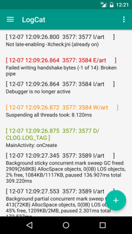
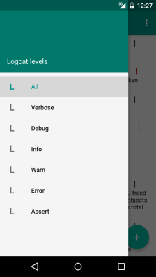

# Android-Clog
#### Android library to show Logcat messages
Includes Recycler View's Adapter with ability fetch and filter log's messages by level

#### How to use

##### Include library in project
- copy [clog-library-release.aar](./library/libs/clog-library-release.aar) into your application *module* `./app/libs` directory
- add `flatDir{dirs 'libs'}` into project root `./build.grable` in all occurance of *repositories* tag 
```
    repositories {
        jcenter()
        flatDir {
            dirs 'libs'
        }
    }
```
- add `compile (name:'clog-library-release', ext:'aar')` into your application *module* `./app/build.grable`

##### Setup Recycler Adapter
- create your own class and extend library `RecyclerAdapter`, complete example in demo project [MainActivity.class](./demo/src/main/java/ru/org/adons/clog/demo/MainActivity.java)
```
...
    private class MyRecyclerAdapter extends RecyclerAdapter {
...
```
- set this class as adapter for RecyclerView
```
        RecyclerView recyclerView = (RecyclerView) findViewById(R.id.recyclerview);
        recyclerView.setLayoutManager(new LinearLayoutManager(this));
        adapter = new MyRecyclerAdapter();
        recyclerView.setAdapter(adapter);
```

##### Load Messages and show message's details 
- use asynchronous method `loadItems()` to load all LogCat messages into RecyclerView
```
        FloatingActionButton fab = (FloatingActionButton) findViewById(R.id.fab);
        fab.setOnClickListener(new View.OnClickListener() {
            @Override
            public void onClick(View view) {
                adapter.loadItems();
            }
        });
```
- use `clearItems()` to clear RecyclerView
- use callback `onLoadStarted()` and `onLoadFinished(boolean isLoadSuccess)` to show progress bar during loading and hide after
- each RecyclerView item show only header of message with all metadata fields (date, process id) and first row from message's body, to show whole message body use `onClickItem(String logMessage)`
```
    private class MyRecyclerAdapter extends RecyclerAdapter {
        @Override
        public void onLoadStarted() {
            progressBar.setVisibility(View.VISIBLE);
        }

        @Override
        public void onLoadFinished(boolean isLoadSuccess) {
            progressBar.setVisibility(View.INVISIBLE);
            if (!isLoadSuccess) {
                Toast.makeText(MainActivity.this, RecyclerAdapter.ERROR_MESSAGE, Toast.LENGTH_SHORT).show();
            }
        }

        @Override
        public void onClickItem(String logMessage) {
            Intent intent = new Intent(MainActivity.this, DetailsActivity.class);
            intent.putExtra(EXTRA_MESSAGE, logMessage);
            startActivity(intent);
        }
    }
```


##### Filtration by Level
Use `filterByLevel(Message.Level level)` method to show only messages with certain log level. *Message.Level* is one constant from `{VERBOSE, DEBUG, INFO, WARN, ERROR, ASSERT}`
```
    private void filterList(int itemID) {
        Message.Level level = null;
        switch (itemID) {
            case R.id.nav_verbose:
                level = Message.Level.VERBOSE;
                break;
            case R.id.nav_debug:
                level = Message.Level.DEBUG;
                break;
            case R.id.nav_info:
                level = Message.Level.INFO;
                break;
            case R.id.nav_warn:
                level = Message.Level.WARN;
                break;
            case R.id.nav_error:
                level = Message.Level.ERROR;
                break;
            case R.id.nav_assert:
                level = Message.Level.ASSERT;
        }
        adapter.filterByLevel(level);
    }
```

